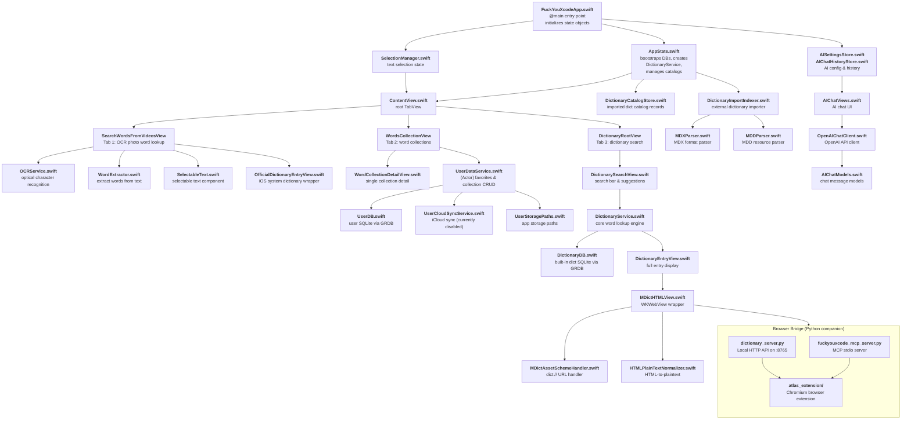

# FuckYouXcode

An iOS dictionary application built with SwiftUI, designed for English learners who need instant word lookup and vocabulary management. It combines a built-in SQLite-powered English-Chinese dictionary with support for importing external MDict-format dictionaries (e.g., Oxford Advanced Learner's Dictionary). Users can look up words through text search, OCR-based photo recognition, or an AI-powered chat assistant. The app offers word collections, favorites management, and multi-catalog dictionary switching. A companion Python server and browser extension extend dictionary lookup to desktop browsers via a local HTTP API and MCP (Model Context Protocol) interface.

## Architecture Overview

