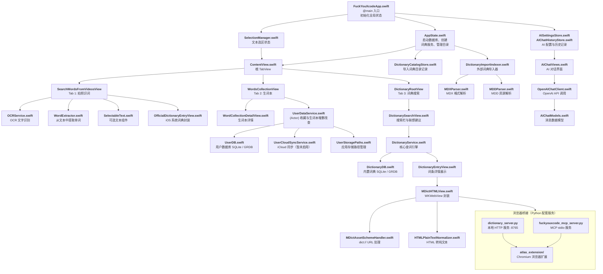

# FuckYouXcode

## blablabla🥱
起因是在Netflix和Disney plus上看剧时想边看剧边截图学习单词，但是因为屏幕保护，截出来的图只有纯字幕，所以便想着做一个app，来批量进行OCR识别并筛选出真正需要的单词，进行高效学习。但是后来功能越做越多。

## 概述
一个基于 SwiftUI 构建的 iOS 英语学习应用，面向需要即时查词和词汇管理的英语学习者。内置 SQLite 英汉词典，并支持导入外部 MDict 格式词典（如牛津高阶英汉双解词典）。用户可通过文本搜索、拍照 OCR 识别或 AI 对话助手三种方式查词。支持生词收藏、词汇本管理、多词典切换。附带的 Python 本地服务器和浏览器扩展，可通过 HTTP API 和 MCP（模型上下文协议）将词典功能延伸至桌面浏览器。

## 架构总览

